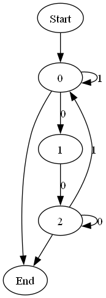

# Лабораторная работа №1. Распознавание цепочек регулярного языка

----
Студент гр. ИУ7-22М Шингаров И. Д.
----

## Задание
Напишите программу, которая в качестве входа принимает произвольное регулярное выражение, и выполняет следующие преобразования:
1. Преобразует регулярное выражение непосредственно в ДКА.
2. По ДКА строит эквивалентный ему КА, имеющий наименьшее возмоджное количество состояний. Указание. Воспользоваться алгоритмом Бржозовского.
3. Моделирует минимальный КА для входной цепочки из терминалов исходной грамматики.


## Результат работы
Результаты выполнения этапов для выражения `(a|b)*abb`

### Дерево разбора
```
                                                                                        __[1, 2, 3] [.] [6]__
                                                                                       /                     \
                                                                         ___[1, 2, 3] [.] [5]__        [6] [#:6] [6]
                                                                       /                       \
                                                  _______[1, 2, 3] [.] [4]___             [5] [b:5] [5]
                                                 /                           \
                                   _______[1, 2, 3] [.] [3]______       [4] [b:4] [4]
                                  /                              \
                        ______[1, 2] [*] [1, 2]             [3] [a:3] [3]
                       /
        ____[1, 2] [|] [1, 2]___
       /                         \
[1] [a:1] [1]              [2] [b:2] [2]
```
### ДКА


### Минимизированный КА


## Контрольные вопросы
1. Какие из следующих множеств регулярны? Для тех  которые регулярны, напишите регулярные выражения.
   1. Множество цепочек с равным числом нулей и единиц. (Не является регулярным языком)
   2. Множество цепочек из {0, 1}*, длины которых делятся на 3.`((0|1)(0|1)(0|1))*`
   3. Множество цепочек из {0, 1}*, с четным числом нулей и нечетным числом единиц.
   `((0110)|(1001)|(1010)|(0101)|(11)|(00))*1((0110)|(1001)|(1010)|(0101)|(11)|(00))*`
   4. Множество цепочек из {0, 1}*, не содержащих подцепочки 101. `((000*)|1)*`
2. Найдите праволинейные грамматики для тех мн-в из вопроса 1, которые регулярны.
   1. (2)
   $$
   S \leftarrow A \\
   A \leftarrow 0B \\
   A \leftarrow 1B \\
   A \leftarrow \epsilon \\
   B \leftarrow 0C \\
   B \leftarrow 1C \\
   C \leftarrow 0A \\
   C \leftarrow 1A \\
   $$
   2. (3) 
   $$
   S \leftarrow 0110S \\
   S \leftarrow 1001S \\
   S \leftarrow 1010S \\
   S \leftarrow 0101S \\
   S \leftarrow 11S \\
   S \leftarrow 00S \\
   S \leftarrow 1B \\
   B \leftarrow 0110B \\
   B \leftarrow 1001B \\
   B \leftarrow 1010B \\
   B \leftarrow 0101B \\
   B \leftarrow 11B \\
   B \leftarrow 00B \\
   B \leftarrow \epsilon \\
   $$
   3. (4)
   $$
   S \leftarrow 00A \\
   S \leftarrow 1S \\
   A \leftarrow 0A \\
   A \leftarrow 1S \\
   S \leftarrow \epsilon \\
   $$

3. Найдите ДКА для тех мн-в которые регулярны. 
   1. (1) Не регулярный
   2. (2) 
   3. (3) 
   4. (4) 

3. Найдите минимальный конечный автомат для языка 
   $$ 
   M = \lparen \lbrace A, B, C, D, E \rbrace, \lbrace 0, 1\rbrace, d, A, \brace E, F \rbrace \rparen
   $$

| Состояние | Вход |     |
| --------- | ---- | --- |
|           | 0    | 1   |
| A         | B    | C   |
| B         | E    | F   |
| C         | A    | A   |
| D         | F    | E   |
| E         | D    | F   |
| F         | D    | E   |


