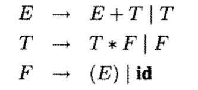
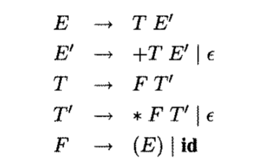
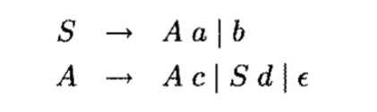
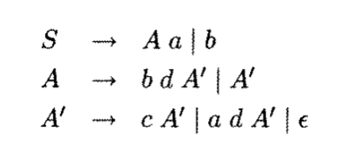

# Лабораторная работа №2. Преобразования грамматик

Студент гр. ИУ7-22М

Шингаров И. Д.

---------------

## Задание

Постройте программу, которая в качестве входа принимает приведенную КС-грамматику $G$ и преобразует ее в эквивалентную грамматику $G'$ без левой рекурсии.

Вариант 4. Устранение цепных правил

Постройте программу, которая в качестве входа принимает произвольную КС-грамматику $G' = (N, \sum, P, S)$ без $\varepsilon-\text{правил}$ и преобразует ее в эквивалентную КС-грамматику $G' = (N, \sum, P', S)$ без $\varepsilon-\text{правил}$ и цепных правил.

Дана грамматика: (Пример 2.24 | Пример 2.27)
$$
\begin{align*}
[&E, F, T],[(, ), +, -, a]E \\ 
&E \rightarrow E + T \;|\; T \\
&T \rightarrow T * F \;|\; F \\
&F \rightarrow (E) \;|\; a
\end{align*}
$$

Имеем прямую левую рекурсию
$$
\begin{align*}
E \rightarrow& E + T \;|\; T \\
T \rightarrow& T * F \;|\; F \\
\end{align*}
$$

Примрер 4.7

Примрер 4.9

## Контрольные вопросы
1.	Как может быть определён формальный язык?
    1.	Простым перечислением слов, входящих в данный язык.
    2.	Словами, порождёнными некоторой формальной грамматикой
    3.	Словами, порождёнными регулярным выражением.
    4.	Словами, распознаваемыми некоторым конечным автоматом
2.	Какими характеристиками определяется грамматика?
    1.	$Σ$ – множество терминальных символов
    2.	$N$ – множество нетерминальных символов
    3.	$P$ – множество правил (слева – непустая последовательность терминалов/нетерминалов, содержащая хотя бы один нетерминал, справа – любая последовательность терминалов/нетерминалов)
    4.	$S$ – начальный символ из множества нетерминалов
3.	Дайте описания грамматик по иерархии Хомского. 
    1. Регулярные 
    2. Контекстно-свободные
    3. Контекстно-зависимые
    4. Неограниченные
4.	Какие абстрактные устройства используются для разбора грамматик?
    1.	Распознающие грамматики – устройства (алгоритмы), которым на вход подается цепочка языка, а на выходе устройство печатает «Да», если цепочка принадлежит языку, и «Нет» — иначе.
    2.	Порождающие грамматики - вид устройств, использующийся для порождения цепочек языков по требованию.
5.	Оцените временную и емкостную сложность предложенного вам алгоритма
    1. Алгоритм удаления левой рекурсии
        1.	$O(N^2)$ – временная сложность
        2.	$O(N)$ – ёмкостная сложность
    2. Алгоритм удаления цепных правил
       1. $O(N^2)$ – временная сложность
       2. $O(N)$ – ёмкостная сложность
